# TA·TE·TI GIGANTE

Ta-Te-Ti Gigante (Ultimate Tic-Tac-Toe): 9 tatetis chicos adentro de un tablero grande. Ganás cuando hacés línea de 3 en el tablero grande, pero cada jugada te manda a jugar a un tablero chico específico. Elegí entre 4 variantes de juego (Clásico, Misère, Blitz o Infinito), jugá solo contra la computadora, con un amigo en el mismo dispositivo, o a distancia por internet con código de sala.

🎮 **Jugá acá:** [TA-TE-TI GIGANTE](https://adrianivanchen.github.io/TATETIGIAGANTE/)

## Reglas del juego

El tablero grande tiene 9 cuadrantes, y cada cuadrante es un tateti (3 en línea) chico de 9 casillas.

- Ganás una partida cuando hacés línea de 3 cuadrantes ganados en el tablero grande (horizontal, vertical o diagonal) — igual que en un tateti normal, pero un nivel más arriba.
- La casilla donde jugás dentro de un cuadrante decide en qué cuadrante le toca jugar al rival después. Por ejemplo, si jugás en la casilla de arriba a la derecha de cualquier cuadrante, el próximo turno se juega en el cuadrante de arriba a la derecha del tablero grande.
- Si te mandan a un cuadrante que ya está resuelto (ganado o empatado), quedás libre de elegir cualquier cuadrante que siga disponible.
- Un cuadrante se gana haciendo 3 en línea adentro de ese mini-tateti; si se llena sin que nadie gane, queda empatado (no cuenta para nadie).
- El cuadrante donde te toca jugar queda resaltado en el tablero.

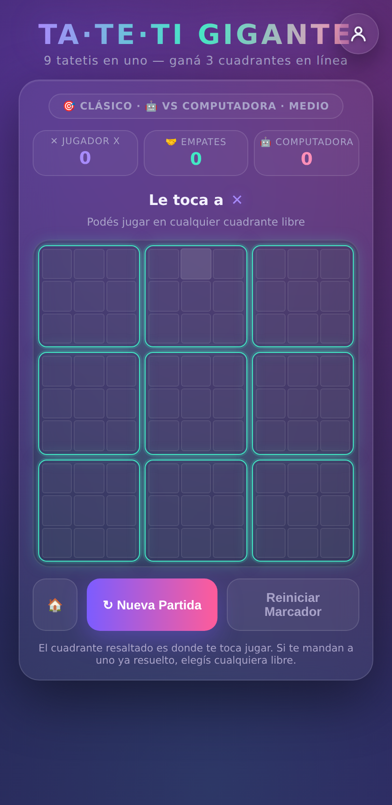

Cuando alguien completa la línea de 3 cuadrantes, se dibuja la línea ganadora y se suma al marcador:

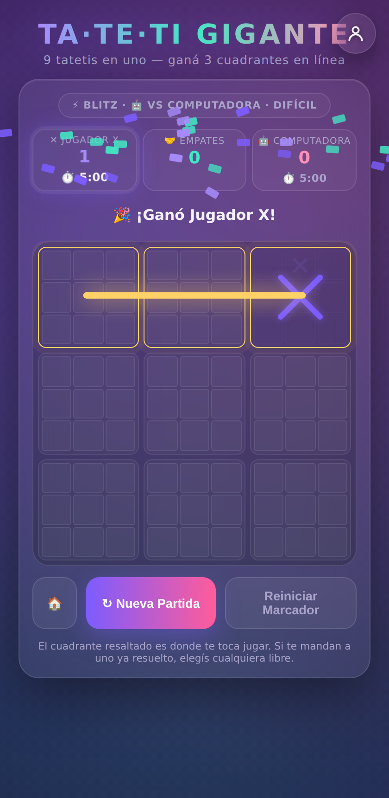

Dentro del juego, el ícono 📖 **Reglas** del menú principal tiene esta misma explicación junto con el detalle de cada variante, siempre a mano sin salir de la app.

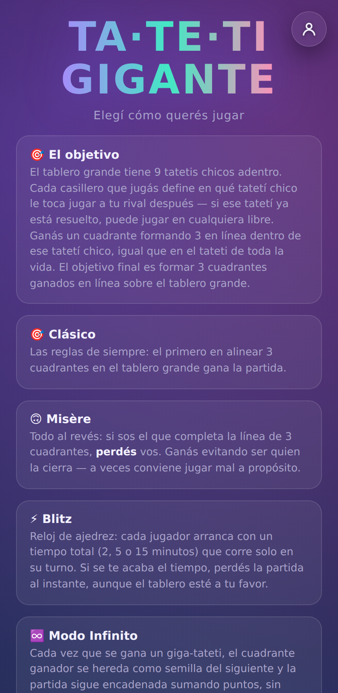

## Cómo se arma el menú

Al entrar hay solo tres opciones: **Offline**, **Online** y **Reglas**.

**Offline** se abre en dos formas de jugar en el mismo dispositivo:

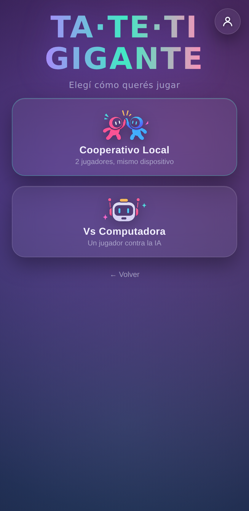

- **Cooperativo Local**: dos jugadores turnándose en el mismo dispositivo, sin computadora de por medio.
- **Vs Computadora**: jugás solo contra la IA.

Elijas la que elijas, después te pide la **variante de juego**:

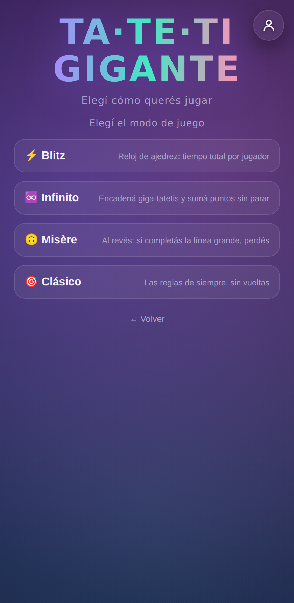

Si jugás **Vs Computadora**, después de la variante te pide la **dificultad de la IA** (Fácil, Medio o Difícil):

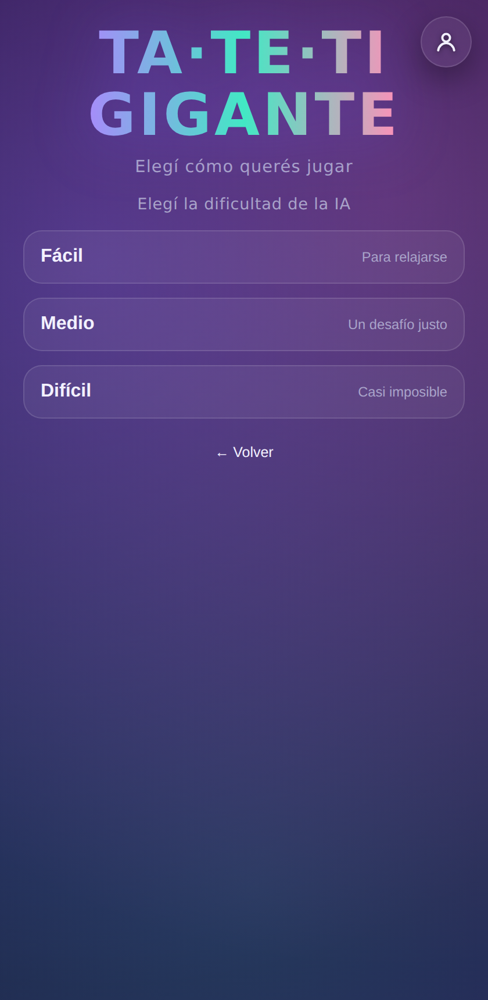

Y si elegís la variante **Blitz**, antes te pide cuánto tiempo total por jugador querés (2, 5 o 15 minutos):

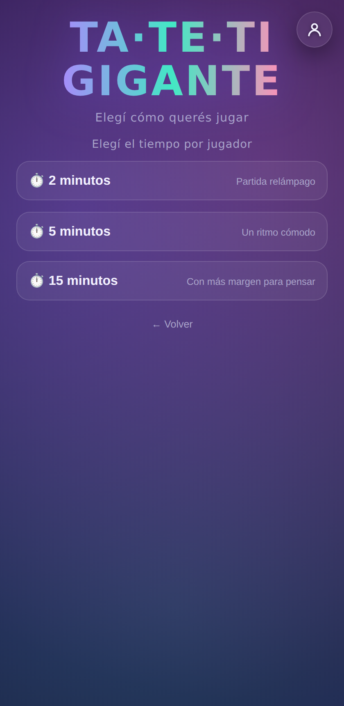

Una vez armada la partida, un sorteo animado con moneda decide quién empieza:

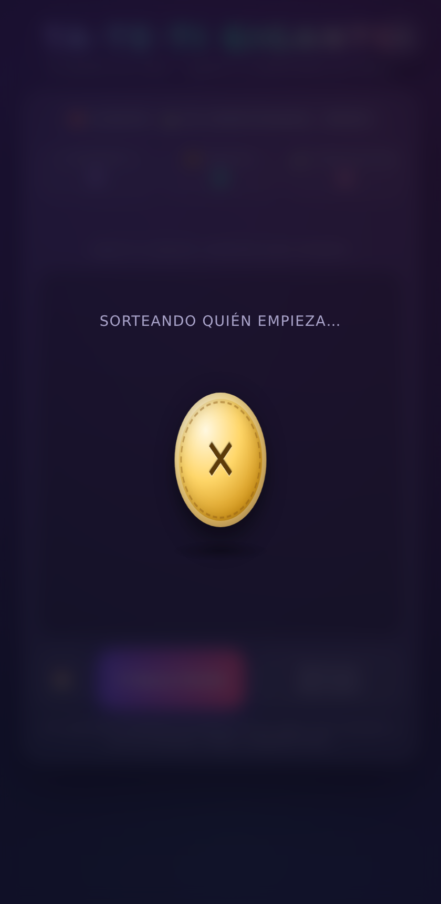

## Las 4 variantes de juego

Tanto en Offline (Cooperativo Local o Vs Computadora) como en Online podés elegir entre estas cuatro:

### 🎯 Clásico

Las reglas de siempre: el primero en alinear 3 cuadrantes en el tablero grande gana la partida.

### 😵 Misère

Todo al revés: si sos el que completa la línea de 3 cuadrantes, **perdés** vos. Ganás evitando ser quien la cierra — a veces conviene jugar mal a propósito.

### ⚡ Blitz

Reloj de ajedrez: cada jugador arranca con un tiempo total (2, 5 o 15 minutos, a elección) que corre solo mientras es su turno. Los relojes de cada jugador se ven debajo del marcador. Si a alguien se le acaba el tiempo, pierde la partida al instante, aunque el tablero esté a su favor.

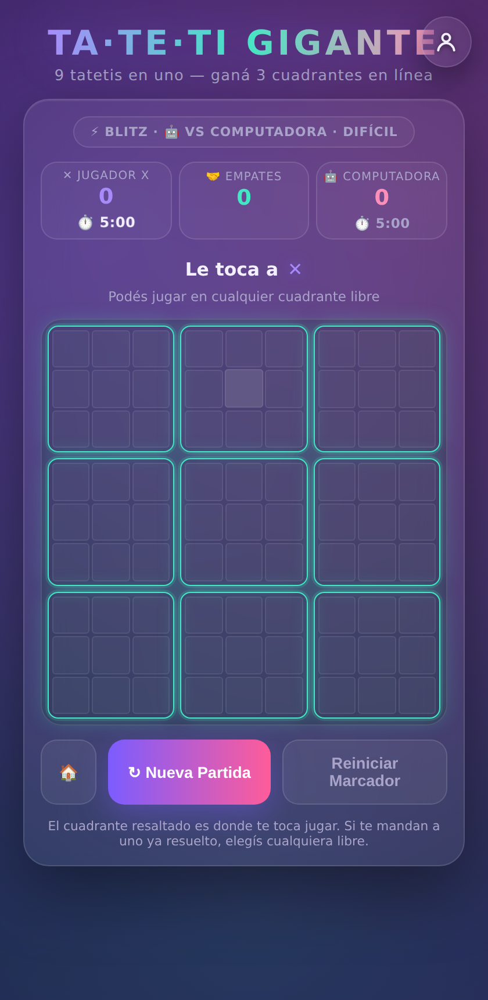

### ♾️ Infinito

Se juegan giga-tatetis encadenados sumando puntos: 10 puntos por cada cuadrante ganado en la ronda, más un bonus de 50 puntos por ganar el giga-tateti completo. Al ganar una ronda, el tablero se achica y se agranda para arrancar la siguiente, con el último cuadrante ganado ya marcado a favor. La cadena (y el puntaje, que en Cooperativo Local y Online es compartido entre los dos jugadores) se corta recién cuando una ronda termina en empate.

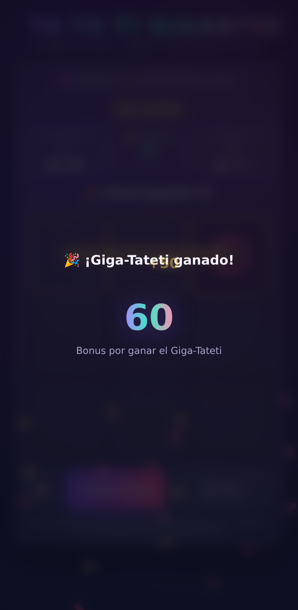

Una vez que arrancaste una partida, la variante y la dificultad quedan fijas hasta que volvés al menú (los marcadores no se pierden al ir y volver).

## 🌐 Multijugador Online

Desde el menú principal, **Online** te lleva a crear o unirte a una sala:

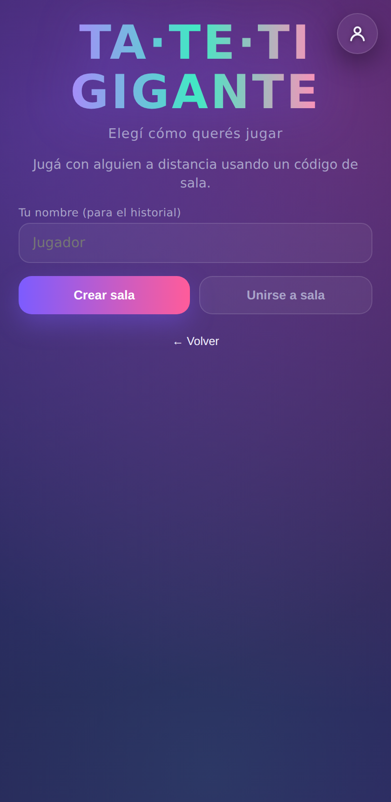

Al elegir **Crear sala** primero elegís la variante de juego (y el tiempo, si es Blitz) igual que en Offline, y recién ahí se genera la sala. Se comparte un código de 9 caracteres; el otro jugador lo ingresa desde "Unirse a sala" para entrar a la misma partida:

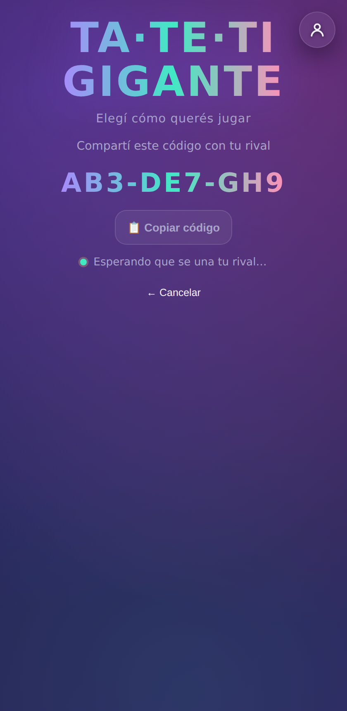

Antes de crear o unirte a una sala, si no tenés una cuenta te pide un nombre (para identificarte en el historial de partidas). Cuando el rival se une, la partida arranca automáticamente para los dos, con la variante, el tiempo y las reglas que eligió quien creó la sala.

> El modo online necesita conexión real a internet — no funciona si estás mirando el juego dentro de una vista previa de Claude, solo abriendo la página de verdad o el ejecutable de Windows.

## Perfil, cuenta y estadísticas

Con el ícono 👤 (arriba a la derecha) accedés a tu perfil. Es opcional: podés jugar sin cuenta, pero si te registrás se guardan tus estadísticas.

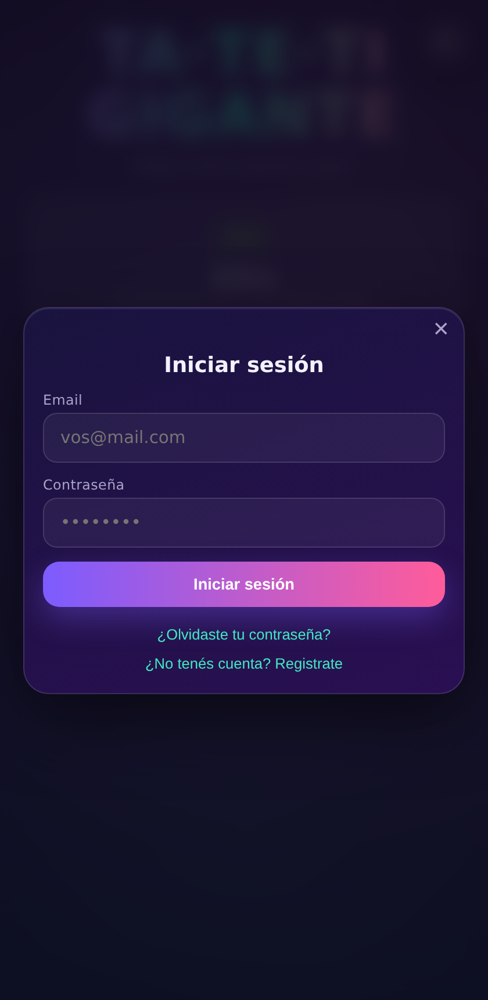
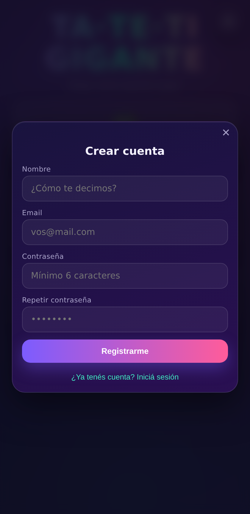

Al registrarte te llega un mail para confirmar la cuenta. Si te olvidaste la contraseña, "¿Olvidaste tu contraseña?" te manda un link por mail para elegir una nueva.

Una vez logueado, tu perfil muestra:

- Tu nombre (editable) y una foto de perfil, que podés subir y encuadrar en formato circular con el recorte integrado.
- Tu mejor puntaje del Modo Infinito, por cada dificultad.
- Cuántas partidas online ganaste, perdiste y empataste.
- El historial de tus últimas partidas online, con el nombre del rival y el resultado.

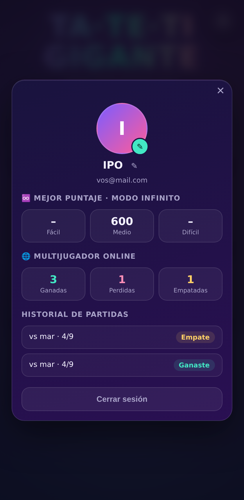
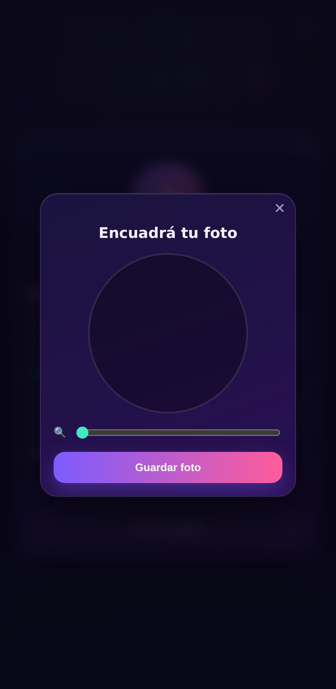

Un mismo mail solo puede estar asociado a una cuenta.

## Jugar con amigos

1. Entrá a [TA-TE-TI GIGANTE](https://adrianivanchen.github.io/TATETIGIAGANTE/) (o abrí el `.html` / `.exe` si lo tenés descargado).
2. Elegí "Online" → "Crear sala", y elegí la variante (y el tiempo, si es Blitz).
3. Copiá el código de 9 caracteres y pasáselo a tu amigo (por chat, por ejemplo).
4. Tu amigo entra al mismo link, toca "Online" → "Unirse a sala" e ingresa el código.
5. Cuando se une, la partida arranca automáticamente para los dos.

## Créditos técnicos

Juego construido como una única página HTML autocontenida (sin instalación), con Supabase como backend para el multijugador online y las cuentas de usuario. También existe como ejecutable de Windows standalone.
