# TA·TE·TI GIGANTE

Ta-Te-Ti Gigante (Ultimate Tic-Tac-Toe): 9 tatetis chicos adentro de un tablero grande. Ganás cuando hacés línea de 3 en el tablero grande, pero cada jugada te manda a jugar a un tablero chico específico. Jugá solo contra la computadora, en modo Infinito encadenando partidas, con un amigo en el mismo dispositivo, o a distancia por internet con código de sala.

🎮 **Jugá acá:** https://adrianivanchen.github.io/TATETIGIAGANTE/

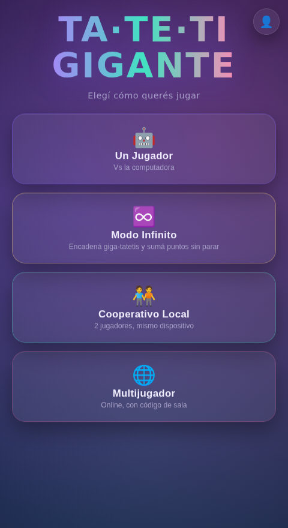

## Reglas del juego

El tablero grande tiene 9 cuadrantes, y cada cuadrante es un tateti (3 en línea) chico de 9 casillas.

- Ganás una partida cuando hacés línea de 3 cuadrantes ganados en el tablero grande (horizontal, vertical o diagonal) — igual que en un tateti normal, pero un nivel más arriba.
- La casilla donde jugás dentro de un cuadrante decide en qué cuadrante le toca jugar al rival después. Por ejemplo, si jugás en la casilla de arriba a la derecha de cualquier cuadrante, el próximo turno se juega en el cuadrante de arriba a la derecha del tablero grande.
- Si te mandan a un cuadrante que ya está resuelto (ganado o empatado), quedás libre de elegir cualquier cuadrante que siga disponible.
- Un cuadrante se gana haciendo 3 en línea adentro de ese mini-tateti; si se llena sin que nadie gane, queda empatado (no cuenta para nadie).
- El cuadrante donde te toca jugar queda resaltado en el tablero.

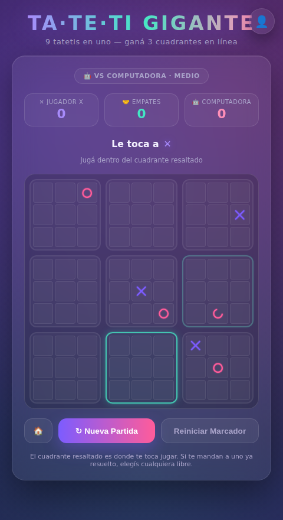

Cuando alguien completa la línea de 3 cuadrantes, se dibuja la línea ganadora y se suma al marcador:

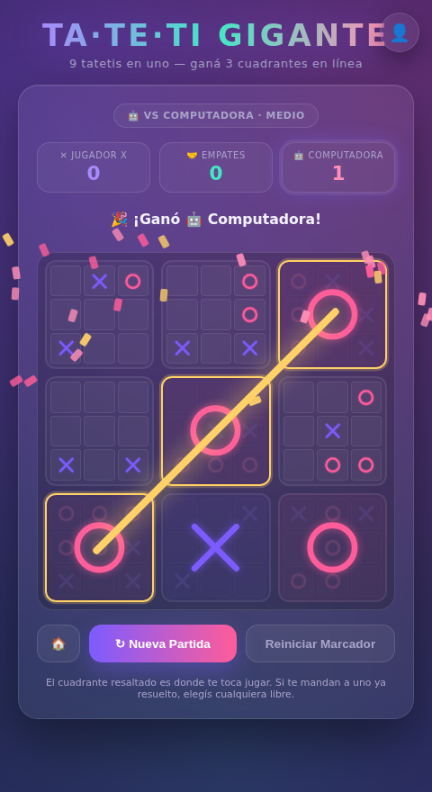

## Modos de juego

Desde la pantalla de inicio elegís uno de los cuatro modos. Una vez que arrancaste una partida, el modo y la dificultad quedan fijos hasta que volvés al menú (los marcadores no se pierden al ir y volver).

### 🤖 Un Jugador

Jugás contra la computadora. Antes de arrancar elegís la dificultad: Fácil, Medio o Difícil. Un sorteo animado con moneda decide quién empieza cada partida.

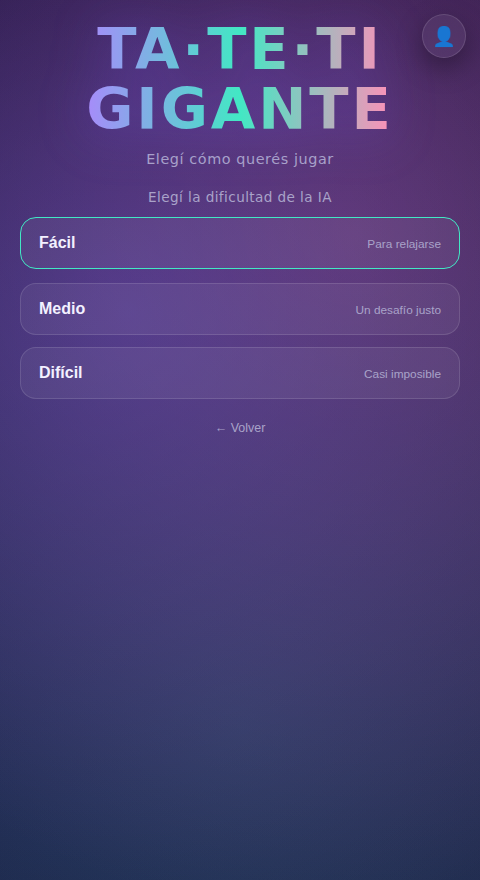
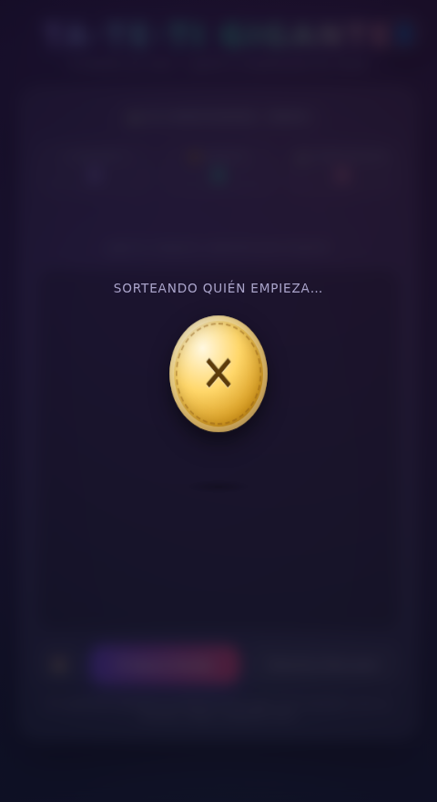

### ♾️ Modo Infinito

Jugás giga-tatetis seguidos contra la computadora, sumando puntos: 10 puntos por cada cuadrante que ganaste en esa ronda, más un bonus de 50 puntos por ganar el giga-tateti completo. Al ganar, el tablero se achica y se agranda para arrancar la ronda siguiente, con el último cuadrante que ganaste ya marcado a tu favor. La racha (y el puntaje) se corta recién cuando perdés o empatás un giga-tateti completo.

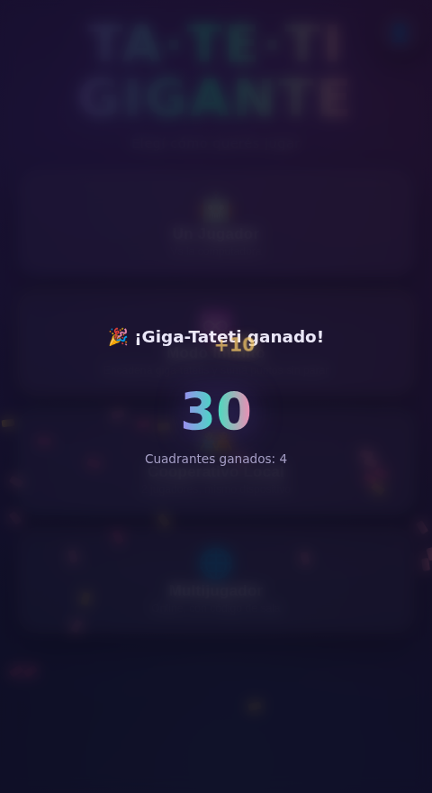

### 🧑‍🤝‍🧑 Cooperativo Local

Dos jugadores turnándose en el mismo dispositivo, sin computadora de por medio.

### 🌐 Multijugador Online

Jugás a distancia con otra persona, cada uno desde su dispositivo. Uno crea una sala y comparte el código de 9 caracteres; el otro lo ingresa para unirse. Antes de crear o unirte a una sala, si no tenés una cuenta te pide un nombre (para identificarte en el historial de partidas).

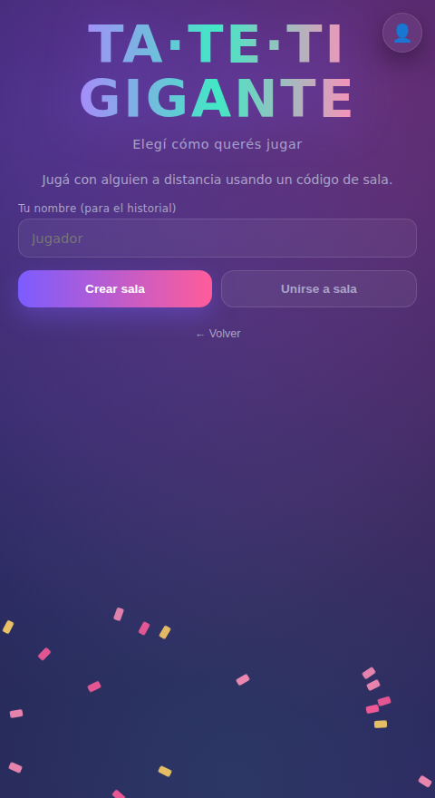
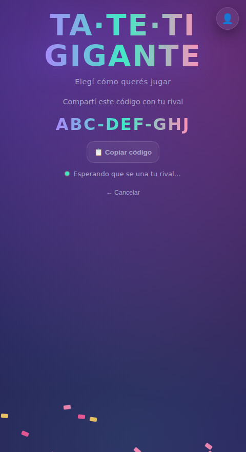

> El modo online necesita conexión real a internet — no funciona si estás mirando el juego dentro de una vista previa de Claude, solo abriendo la página de verdad o el ejecutable de Windows.

## Perfil, cuenta y estadísticas

Con el ícono 👤 (arriba a la derecha) accedés a tu perfil. Es opcional: podés jugar sin cuenta, pero si te registrás se guardan tus estadísticas.

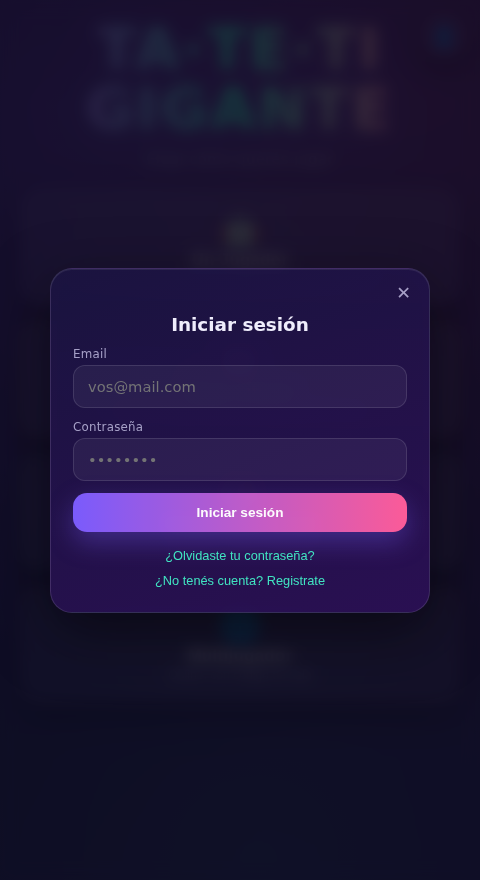
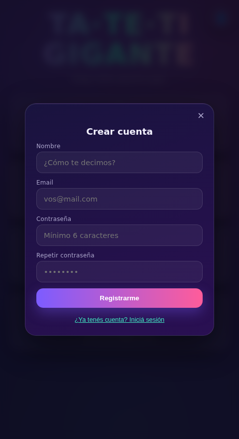

Al registrarte te llega un mail para confirmar la cuenta. Si te olvidaste la contraseña, "¿Olvidaste tu contraseña?" te manda un link por mail para elegir una nueva.

Una vez logueado, tu perfil muestra:

- Tu nombre (editable) y una foto de perfil, que podés subir y encuadrar en formato circular con el recorte integrado.
- Tu mejor puntaje del Modo Infinito, por cada dificultad.
- Cuántas partidas online ganaste, perdiste y empataste.
- El historial de tus últimas partidas online, con el nombre del rival y el resultado.

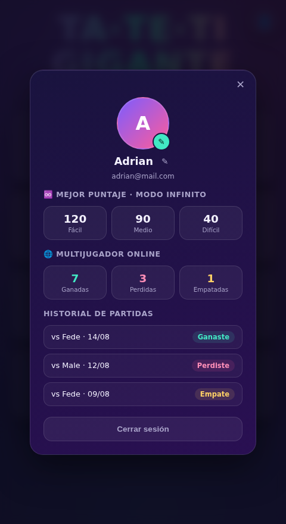
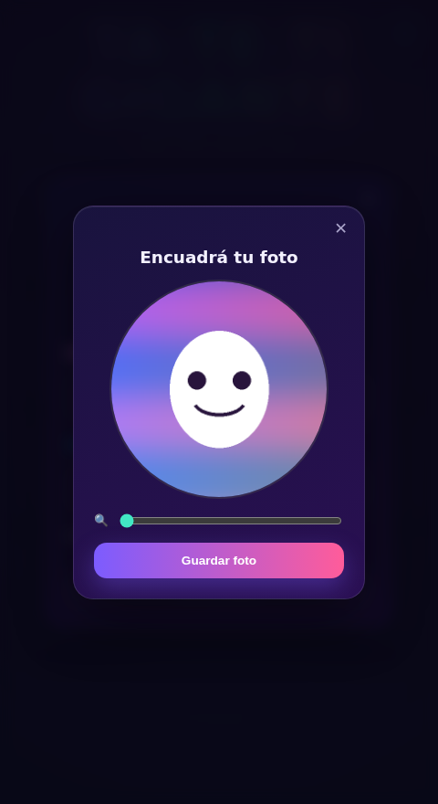

Un mismo mail solo puede estar asociado a una cuenta.

## Jugar con amigos

1. Entrá a https://adrianivanchen.github.io/tateti-gigante/ (o abrí el `.html` / `.exe` si lo tenés descargado).
2. Elegí "Multijugador" → "Crear sala".
3. Copiá el código de 9 caracteres y pasáselo a tu amigo (por chat, por ejemplo).
4. Tu amigo entra al mismo link, toca "Multijugador" → "Unirse a sala" e ingresa el código.
5. Cuando se une, la partida arranca automáticamente para los dos.

## Créditos técnicos

Juego construido como una única página HTML autocontenida (sin instalación), con Supabase como backend para el multijugador online y las cuentas de usuario. También existe como ejecutable de Windows standalone.
